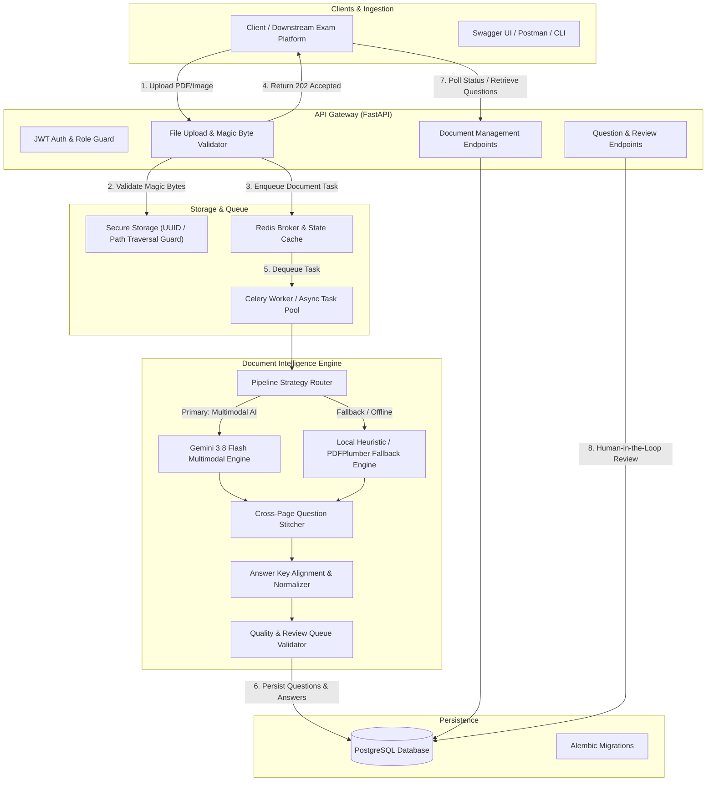
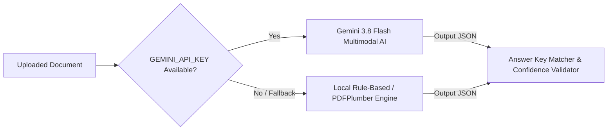
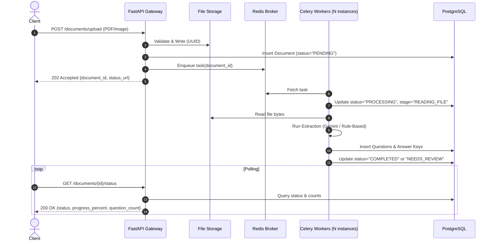

# Pragati Bharati - Document Intelligence & Question Extraction Service
## Architectural Design & Engineering Specification

---

## 1. Executive Summary

This document presents the architectural design and engineering trade-offs of the **Document Intelligence & Question Extraction Service** built for **Pragati Bharati**.

The system addresses the challenge of transforming unstructured, highly variable, and imperfect examination materials (PDFs and images) into clean, standardized, machine-readable question representations. The design adheres strictly to the architectural constraints: **FastAPI**, **PostgreSQL**, **Redis**, asynchronous background processing, environment-based configuration, and robust security.

---

## 2. Overall System Architecture

The service follows a layered, service-oriented architecture with decoupled ingestion, asynchronous processing, and API access layers.

---

## 3. Core Architectural Components

### 3.1 API Layer (FastAPI)
- **Framework**: FastAPI with Pydantic v2 validation models.
- **Asynchronous Ingestion**: File uploads return `202 Accepted` immediately with a unique `document_id` and a `status_url`. No client connection is kept waiting during heavy OCR or LLM operations.
- **RFC 7807 Error Handling**: Centralized exception handlers catch `AppException`, `FileValidationException`, `NotFoundException`, and `ForbiddenException`, returning standardized, machine-readable JSON error payloads.

### 3.2 Asynchronous Processing Architecture
- **Queue Broker**: **Redis** serves as the message broker and transient state cache.
- **Workers**: **Celery** workers consume tasks independently from the API server (`app.workers.tasks.process_document_task`).
- **Dual Mode Execution**:
  - **Distributed Production Mode (`CELERY_ENABLED=True`)**: Celery workers run in separate containers, providing horizontal scalability and worker concurrency control.
  - **Lightweight Standalone Mode (`CELERY_ENABLED=False`)**: Uses FastAPI's `BackgroundTasks` directly in-process. This ensures evaluators can run the service and tests without requiring external background daemons if desired.
- **Granular Status Tracking**: Every document transitions through tracked stages:
  `PENDING` $\rightarrow$ `READING_FILE` (15%) $\rightarrow$ `EXTRACTING_QUESTIONS` (35%) $\rightarrow$ `ASSOCIATING_ANSWERS` (65%) $\rightarrow$ `VALIDATING` (85%) $\rightarrow$ `DONE` (100%) or `ERROR`.

---

## 4. Document Intelligence & Extraction Strategy

Examination documents exhibit wide variation: single or multi-column layouts, mixed fonts, cross-page continuations, embedded tables/diagrams, and separated answer keys. To address this, the service implements a **Dual-Engine Strategy**:

### 4.1 Primary Engine: Google Gemini 3.8 Flash Multimodal AI
- **SDK**: `google-genai` (official Google GenAI SDK).
- **Multimodal Understanding**: Accepts raw PDF or image bytes directly via `types.Part.from_bytes()`. Gemini 3.8 Flash handles native layout analysis, OCR for low-resolution/scanned documents, formula transcription, and diagram detection in a single pass.
- **Strict Structured Outputs**: Utilizes `response_schema` backed by Pydantic models (`GeminiExtractionResponse`) to guarantee schema adherence without JSON parsing failures.

### 4.2 Secondary Engine: Local Deterministic Rule-Based Engine
- **Libraries**: `pypdf`, `pdfplumber`, `pillow`.
- **Layout & Text Segmentation**: Extracts text per page, identifies tabular structures via `pdfplumber.extract_tables()`, and preserves page boundaries.
- **Question Boundary Detection**: Regex pattern matching supporting diverse numbering conventions (`1.`, `Q.1`, `Question 1:`, `1)`, `(1)`, `11(a)`). Standalone letters (e.g. `(A)`, `B.`) are explicitly partitioned as option prefixes rather than questions.
- **Cross-Page Question Stitching**: If page $N$ contains an open question stem or incomplete options, and page $N+1$ begins with continuation text or remaining options without a question header, the engine merges the content, assigning both pages to `source_pages: [N, N+1]`.

---

## 5. Answer Key Association Engine

Answer keys may appear:
1. At the end of the same document (`=== ANSWER KEY ===`).
2. At the beginning or inline with questions.
3. In a **separate document** (e.g. `Question Paper.pdf` and `Answer Key.pdf`).

### 5.1 Alignment & Normalization Logic
- **Direct Matching**: Normalized question numbers are matched (e.g., `Q.1`, `Question 1`, and `1)` all resolve to `1`).
- **Explanation Extraction**: Answers like `B (Explanation: 2x = 10 => x = 5)` are cleanly parsed into `normalized_answer = "B"` and `explanation = "2x = 10 => x = 5"`.
- **Cross-Document Association API**:
  `POST /api/v1/documents/{id}/associate` links an answer key document to a question paper. The engine pulls the answer keys from the target document and re-aligns them with the questions in the question paper.
- **Uncertainty & Integrity**:
  - If an answer refers to an option not present in the question (e.g. Answer key says `E` but question only has `A, B, C, D`), status is flagged as `UNCERTAIN` and confidence is penalized.
  - If an answer is missing entirely, status is set to `NOT_FOUND` rather than silently fabricating an answer.

---

## 6. Confidence Scoring & Review Queue Mechanism

Every extracted question receives a quantitative confidence score ($0.0 - 1.0$) and a categorical classification:

| Status | Confidence Range | Criteria |
| :--- | :--- | :--- |
| **`CONFIDENT`** | $\ge 0.85$ | Crisp text, complete options (3+ for MCQ), confirmed answer key, unambiguous numbering. |
| **`PARTIALLY_EXTRACTED`** | $0.70 - 0.84$ | Minor formatting irregularities, cross-page split, or inferred answer key. |
| **`NEEDS_REVIEW`** | $< 0.70$ | Low-resolution/degraded scan, missing options ($<2$), short stem ($<15$ chars), unmatched/uncertain answer key. |

### 6.1 Review Reasons Taxonomy
- `LOW_CONFIDENCE`: Overall score below threshold.
- `CRITICAL_MISSING_OPTIONS`: MCQ with fewer than 2 options.
- `FEW_OPTIONS`: MCQ with only 2 options.
- `SHORT_QUESTION_STEM`: Question prompt $< 15$ characters.
- `CROSS_PAGE_QUESTION`: Question text or options span multiple pages.
- `UNMATCHED_ANSWER`: No answer found in answer key.
- `UNCERTAIN_ANSWER`: Answer key references non-existent option.
- `LOW_RESOLUTION_IMAGE`: Degraded scan quality.
- `CONTAINS_TABLE` / `CONTAINS_DIAGRAM`: Visual element requiring human sign-off.

### 6.2 Human-in-the-Loop Review
Reviewers can query `GET /api/v1/documents/{id}/review-queue` and submit corrections via `PATCH /api/v1/questions/{id}`, marking `is_reviewed=True` and updating status to `CONFIDENT`.

---

## 7. Security Architecture

1. **Authentication & Authorization**:
   - OAuth2 Password Bearer flow with JWT signed via HS256 (`SECRET_KEY`).
   - Role-Based Access Control (`admin`, `reviewer`, `user`).
   - Tenant isolation: users cannot view or mutate documents belonging to other users unless possessing `admin` privileges.
2. **File Validation & Magic Bytes**:
   - Inspects file headers at byte level: `%PDF-` for PDFs, `\xff\xd8\xff` for JPEG, `\x89PNG` for PNG.
   - Rejects spoofed extensions (e.g. executable disguised as `.pdf`).
3. **Path Traversal & Storage Security**:
   - Strips directory components (`os.path.basename`) and sanitizes special characters.
   - Files are stored using UUID-based filenames within a restricted `STORAGE_DIR`.
   - Explicit path containment verification prevents arbitrary file read/write.
4. **Secret Management**:
   - Zero hardcoded credentials. All configuration loaded via `pydantic-settings` and `.env`.

---

## 8. Scalability & Production Readiness

- **Horizontal Scaling**: Celery workers scale independently based on queue length.
- **Connection Pooling**: SQLAlchemy async engine with connection pooling.
- **Idempotent Reprocessing**: `POST /api/v1/documents/{id}/reprocess` safely flushes prior extractions and re-runs the pipeline.

---

## 9. Design Trade-Offs & Limitations

1. **Dual Engine vs. Cloud-Only**:
   - *Trade-off*: Supporting a full local deterministic parser adds codebase complexity compared to exclusively using Gemini.
   - *Rationale*: Guarantees 100% offline evaluation and testing without API key dependency or rate limits, while unlocking state-of-the-art vision extraction when `GEMINI_API_KEY` is present.
2. **Synchronous Fallback vs. Strict Celery**:
   - *Trade-off*: Supporting both in-process `BackgroundTasks` and Celery.
   - *Rationale*: Allows single-container or local laptop testing with zero external broker setup, while preserving distributed Celery in `docker-compose.yml`.
3. **Regex Option Extraction vs. Deep Layout Parser**:
   - *Trade-off*: Regex-based option parsing can be challenged by complex multi-column wraps without OCR bounding boxes.
   - *Rationale*: High execution speed and zero heavy dependencies. When deep visual reasoning is required, Gemini Multimodal handles multi-column layouts natively.
