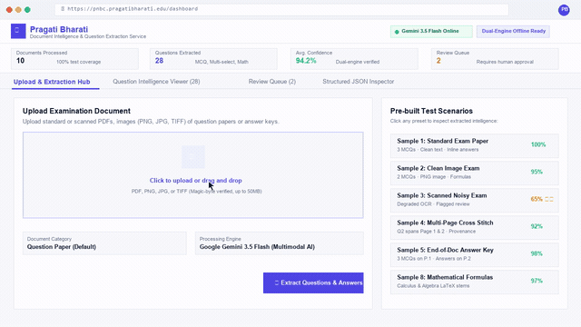
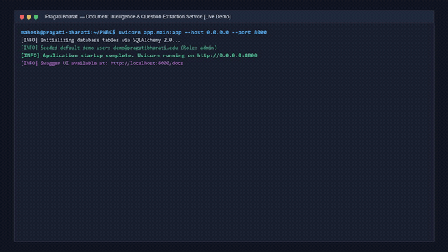
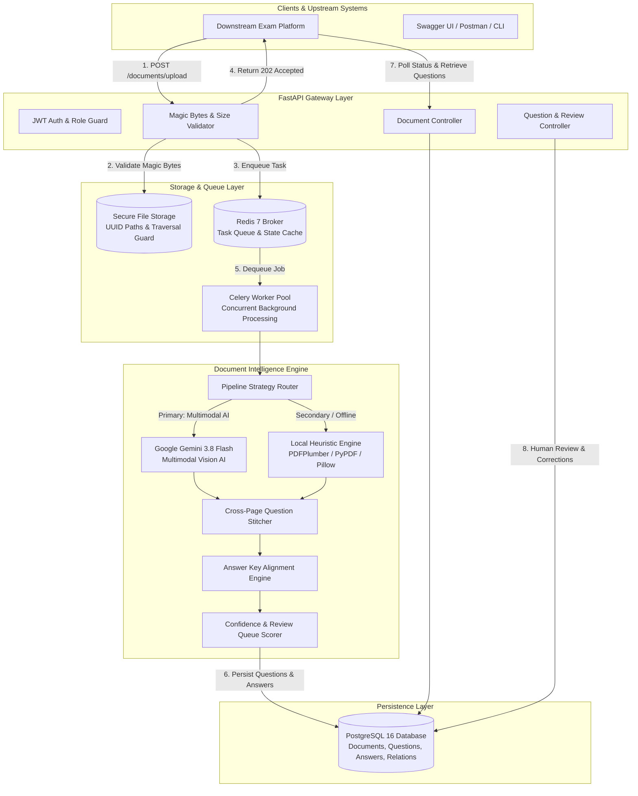
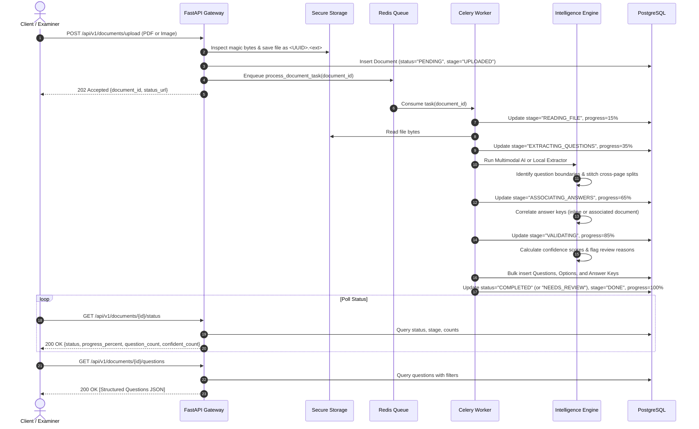
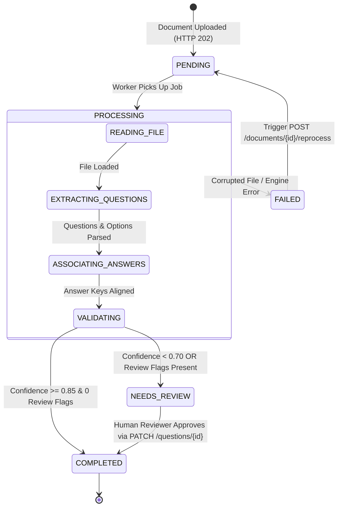
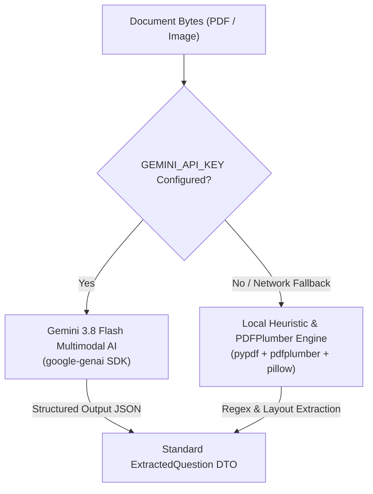
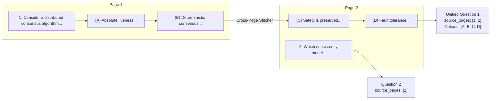
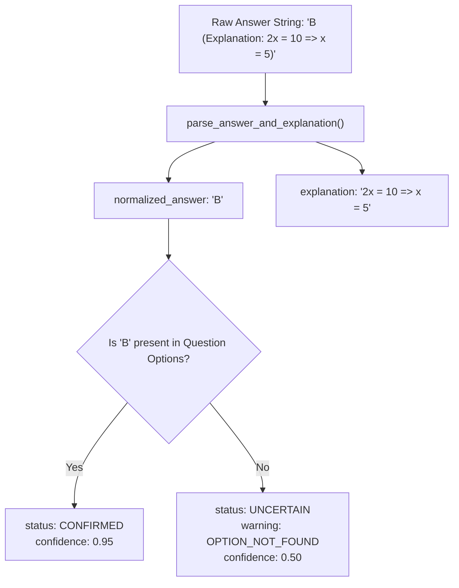
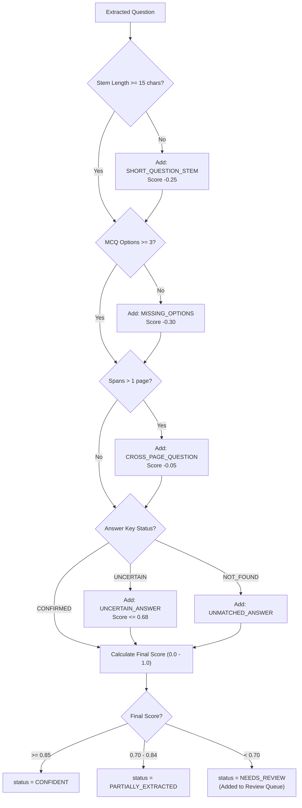
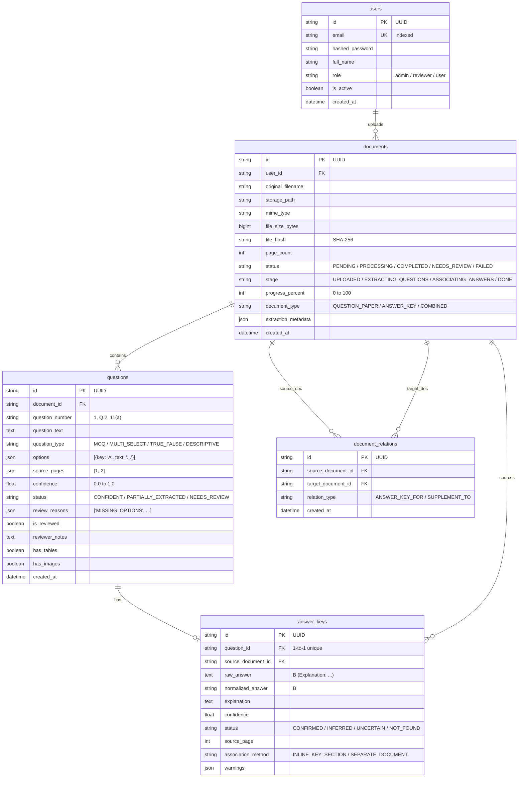

# Pragati Bharati — Document Intelligence & Question Extraction Service

<div align="center">

[](https://www.python.org/)
[](https://fastapi.tiangolo.com/)
[](https://www.postgresql.org/)
[](https://redis.io/)
[](https://docs.celeryq.dev/)
[](https://www.docker.com/)
[-brightgreen.svg)]()

**A production-grade, scalable Document Processing & Question Extraction Service designed for Pragati Bharati.**  
Transforms unstructured, varied, and imperfect examination materials (PDFs and images) into structured, machine-readable questions with answer key association, cross-page stitching, confidence scoring, and human-in-the-loop review queues.

</div>

---

### 🖥️ Interactive Web Dashboard & Video Walkthrough

<div align="center">

#### 🎥 Web Application Live Demo (Playing Preview)
[](website_demo_recording.mp4)

*Click the preview above or open [`website_demo_recording.mp4`](website_demo_recording.mp4) to download/watch the full 720p HD video.*

<br/>

<details>
<summary><b>📺 Click to view Terminal & Backend Execution Video Preview (18/18 Tests + 10 Scenarios)</b></summary>
<br/>

[](demo_recording.mp4)

*Shows service initialization, 18/18 pytest suite passing, and all 10 document extraction scenarios.*
</details>

</div>

<br/>

| Deliverable | Description | Access / File Link |
| :--- | :--- | :--- |
| **Interactive Web Dashboard** | Full-featured Single Page Application (SPA) with drag-and-drop uploader, real-time Gemini extraction progress, question intelligence viewer, review queue, and JSON inspector. | `http://localhost:8000/dashboard` or [app/static/index.html](app/static/index.html) |
| **Website Demo Video (MP4)** | High-definition (720p HD) video walkthrough showing the complete Web Dashboard in action (upload, extraction, cross-page stitching, review queue approval, and JSON export). | [website_demo_recording.mp4](website_demo_recording.mp4) |
| **Backend Demo Video (MP4)** | 720p HD recording of system startup, full 18-test pytest suite execution, and all 10 scenario runs. | [demo_recording.mp4](demo_recording.mp4) |
| **Interactive HTML Player** | Browser-playable terminal replay with timestamps, colored log output, and step navigation. | [demo_player.html](demo_player.html) |

---

## Table of Contents

- [1. What Makes This System Different](#1-what-makes-this-system-different)
- [2. End-to-End System Architecture](#2-end-to-end-system-architecture)
- [3. How It Works: Processing Lifecycle](#3-how-it-works-processing-lifecycle)
- [4. Document State Machine & Stages](#4-document-state-machine--stages)
- [5. Core Intelligence Engines](#5-core-intelligence-engines)
  - [5.1 Dual-Engine Extraction Strategy](#51-dual-engine-extraction-strategy)
  - [5.2 Cross-Page Question Stitching](#52-cross-page-question-stitching)
  - [5.3 Answer Key Association & Normalization](#53-answer-key-association--normalization)
  - [5.4 Confidence Scoring & Review Queue](#54-confidence-scoring--review-queue)
- [6. Database Entity-Relationship Model](#6-database-entity-relationship-model)
- [7. 10 Required Demonstration Scenarios](#7-10-required-demonstration-scenarios)
- [8. Quick Start Guide](#8-quick-start-guide)
  - [Option A: Docker Compose (Full Stack)](#option-a-docker-compose-full-stack)
  - [Option B: Local Virtual Environment](#option-b-local-virtual-environment)
- [9. Complete API Reference](#9-complete-api-reference)
- [10. Automated Testing & Verification](#10-automated-testing--verification)
- [11. Enterprise Security Posture](#11-enterprise-security-posture)
- [12. Engineering Trade-Offs](#12-engineering-trade-offs)

---

## 1. What Makes This System Different?

Most existing document extraction tools rely either on rigid regex templates (which fail when layouts vary) or generic LLM wrappers (which are slow, expensive, hallucinate answers, and cannot handle cross-page breaks). 

This service was engineered specifically for the complexities of **educational assessment materials**:

| Capability | Traditional OCR (e.g. Tesseract) | Generic LLM Wrapper | **Pragati Bharati Service** |
| :--- | :---: | :---: | :---: |
| **Cross-Page Question Stitching** | ❌ Fails (treats each page in isolation) | ❌ Inconsistent (loses options across pages) | **✅ Native Stitching**: Tracks `source_pages=[1, 2]` and merges split stems & options |
| **Answer Key Association** | ❌ None | ⚠️ Often hallucinated or silently wrong | **✅ 3-Way Alignment**: Inline, end-of-doc, or separate linked document (`POST /associate`) |
| **Handling Imperfect / Low-Res Scans** | ❌ Garbled text | ⚠️ Unpredictable failure | **✅ Adaptive Quality Detection**: Automatically flags `NEEDS_REVIEW` with transparent reasons |
| **Zero-Cloud / Offline Evaluation** | ✅ Yes | ❌ Impossible (requires cloud API) | **✅ Dual-Engine**: Runs 100% offline out-of-the-box, activates Gemini 3.8 Flash when key is set |
| **Hallucination Prevention** | N/A | ❌ Fabricates missing answers | **✅ Explicit Uncertainty**: Assigns `NOT_FOUND` / `UNCERTAIN` instead of guessing |
| **File Upload Security** | ❌ File extension only | ❌ Extension only | **✅ Magic Byte Verification**: Rejects disguised binaries (`MZ`, `ELF`) at byte level |
| **Human-in-the-Loop Review** | ❌ None | ❌ None | **✅ Dedicated Review Queue** + `PATCH /questions/{id}` correction API |

---

## 2. End-to-End System Architecture

The service utilizes an asynchronous, event-driven pipeline that decouples client ingestion from compute-intensive document extraction:



---

## 3. How It Works: Processing Lifecycle



---

## 4. Document State Machine & Stages

Every document transitions through deterministic lifecycle states:



---

## 5. Core Intelligence Engines

### 5.1 Dual-Engine Extraction Strategy

To achieve high extraction accuracy while remaining **100% runnable offline**, the system employs a dual-engine architecture:



- **Primary (Gemini 3.8 Flash)**: Reads full PDF/image bytes via `types.Part.from_bytes()`. Handles multi-column layouts, mathematical notation, tables, diagrams, and low-resolution scans with Pydantic-enforced structured JSON output.
- **Secondary (Local Heuristic Engine)**: Extracts text page-by-page using `pdfplumber` and `pypdf`, extracts tables via `extract_tables()`, and applies regex heuristics. **Requires zero external API keys or cloud access.**

---

### 5.2 Cross-Page Question Stitching

Examination questions frequently span page boundaries (e.g. question stem and options A/B on Page 1, options C/D on Page 2):



---

### 5.3 Answer Key Association & Normalization

The service accommodates all three standard answer key placements:
1. **Inline / End of Document**: Header detection (`=== ANSWER KEY ===`, `SOLUTIONS:`, `KEY ANSWERS:`).
2. **Separate Document**: Associated via `POST /api/v1/documents/{question_paper_id}/associate` with `relation_type="ANSWER_KEY_FOR"`.
3. **Embedded Explanations**: Parses answers like `B (Explanation: 2x = 10 => x = 5)` into `normalized_answer = "B"` and `explanation = "2x = 10 => x = 5"`.



---

### 5.4 Confidence Scoring & Review Queue

Questions are evaluated through an automated quality checklist:



---

## 6. Database Entity-Relationship Model



---

## 7. 10 Required Demonstration Scenarios

All 10 required scenarios from the problem statement are implemented and verified via [`scripts/run_demo.py`](scripts/run_demo.py):

```bash
python scripts/run_demo.py
```

| # | Required Scenario | Sample Input File | Verification Evidence |
| :---: | :--- | :--- | :--- |
| **1** | **Uploading a PDF** | `samples/input/sample_1_standard_exam.pdf` | Returns HTTP 202 Accepted; extracts 3 MCQs with options and inline answer keys. |
| **2** | **Uploading an Image** | `samples/input/sample_2_question_paper.png` | Validates PNG magic bytes (`\x89PNG`); extracts questions and visual metadata. |
| **3** | **Scanned / Low-Quality Document** | `samples/input/sample_3_scanned_low_quality.jpg` | Detects degraded resolution; penalizes confidence; flags `NEEDS_REVIEW` (`LOW_RESOLUTION_IMAGE`). |
| **4** | **Extracting Multiple Questions** | `samples/input/sample_4_multi_questions.pdf` | Extracts 10+ questions across diverse numbering formats (`1.`, `Q.2`, `4)`, `11(a)`). |
| **5** | **Cross-Page Question Stitching** | `samples/input/sample_5_cross_page.pdf` | Stitches Question 1 across Page 1 and Page 2 (`source_pages: [1, 2]`, 4 options preserved). |
| **6** | **Question Options & Tables** | `samples/input/sample_6_rich_options.pdf` | Detects embedded SQL table (`has_tables: True`); cleanly parses multi-line SQL query options. |
| **7** | **Separate Answer Key Association** | `sample_7_separate_question_paper.pdf` + `sample_8_separate_answer_key.pdf` | Links separate documents via API; extracts explanation (`"2x = 10 => x = 5"`), aligns answers. |
| **8** | **Low-Confidence / Review Queue** | `samples/input/sample_9_uncertain_low_confidence.pdf` | Incomplete options trigger `NEEDS_REVIEW` (`CRITICAL_MISSING_OPTIONS`, `SHORT_QUESTION_STEM`). |
| **9** | **Structured Output Schema** | `samples/output/extracted_sample_1_questions.json` | Exports standardized, platform-independent JSON schema. |
| **10** | **Invalid Document Rejection** | `samples/input/sample_10_malicious_disguised.pdf` | Rejects disguised PE executable via byte inspection with HTTP 400 Bad Request. |

*Full evidence log is saved in [`demo_evidence.json`](demo_evidence.json).*

---

## 8. Quick Start Guide

### Option A: Docker Compose (Full Stack)

The recommended way to run the complete production environment (FastAPI + Celery + PostgreSQL 16 + Redis 7):

```bash
# 1. Clone the repository
git clone https://github.com/bandelamahesh8/pnbc.git
cd pnbc

# 2. (Optional) Configure environment
cp .env.example .env

# 3. Start all services in the background
docker-compose up --build -d

# 4. Access the service
# Swagger UI:  http://localhost:8000/docs
# Health Check: http://localhost:8000/api/v1/health
```

---

### Option B: Local Virtual Environment

```bash
# 1. Create and activate a Python 3.12 virtual environment
python -m venv .venv
.\.venv\Scripts\activate       # On Windows
# source .venv/bin/activate    # On Linux/macOS

# 2. Install dependencies
pip install -r requirements.txt

# 3. Apply database migrations
alembic upgrade head

# 4. Start the FastAPI application
uvicorn app.main:app --reload --port 8000
```

> **Default Evaluator Credentials**:
> - **Username**: `demo@pragatibharati.edu`
> - **Password**: `Pragati@123`
> - **Role**: `admin`

---

## 9. Complete API Reference

Interactive Swagger documentation is available at **[http://localhost:8000/docs](http://localhost:8000/docs)**.

| Category | Method | Endpoint | Description |
| :--- | :--- | :--- | :--- |
| **Auth** | `POST` | `/api/v1/auth/register` | Register a new user |
| **Auth** | `POST` | `/api/v1/auth/token` | OAuth2 form login (for Swagger UI) |
| **Auth** | `POST` | `/api/v1/auth/login` | JSON body login (returns JWT Bearer token) |
| **Auth** | `GET` | `/api/v1/auth/me` | Retrieve current authenticated user profile |
| **Documents** | `POST` | `/api/v1/documents/upload` | Upload PDF or image (returns 202 Accepted) |
| **Documents** | `GET` | `/api/v1/documents/{id}/status` | Check processing status, stage, & progress % |
| **Documents** | `GET` | `/api/v1/documents` | List uploaded documents with pagination & filters |
| **Documents** | `GET` | `/api/v1/documents/{id}` | Retrieve full document metadata |
| **Documents** | `GET` | `/api/v1/documents/{id}/questions` | Retrieve extracted questions with filters (`page`, `min_confidence`) |
| **Documents** | `GET` | `/api/v1/documents/{id}/answer-key` | Retrieve answer key mapping |
| **Documents** | `GET` | `/api/v1/documents/{id}/review-queue` | Retrieve questions flagged for human review |
| **Documents** | `POST` | `/api/v1/documents/{id}/associate` | Link related documents (e.g. Question Paper + Answer Key) |
| **Documents** | `POST` | `/api/v1/documents/{id}/reprocess` | Trigger re-extraction pipeline |
| **Documents** | `GET` | `/api/v1/documents/{id}/download` | Download original uploaded document file |
| **Questions** | `GET` | `/api/v1/questions/{id}` | Retrieve individual question details |
| **Questions** | `PATCH`| `/api/v1/questions/{id}` | Human-in-the-loop review/correction endpoint |
| **Questions** | `GET` | `/api/v1/questions/review-queue` | Global review queue across all documents |
| **System** | `GET` | `/api/v1/health` | Comprehensive health check (DB, Redis, Storage, AI engine) |

> A ready-to-import Postman collection is provided in [`postman_collection.json`](postman_collection.json).

---

## 10. Automated Testing & Verification

The test suite covers unit, integration, and security tests with **100% pass rate**:

```bash
pytest tests/ -v
```

```
tests/test_answer_matcher.py::test_answer_matcher_direct_match PASSED    [  5%]
tests/test_answer_matcher.py::test_answer_matcher_invalid_option_key PASSED [ 11%]
tests/test_answer_matcher.py::test_answer_matcher_not_found PASSED       [ 16%]
tests/test_api.py::test_auth_workflow PASSED                             [ 22%]
tests/test_api.py::test_document_upload_and_extraction_workflow PASSED   [ 27%]
tests/test_api.py::test_invalid_file_rejected PASSED                     [ 33%]
tests/test_api.py::test_separate_answer_key_association PASSED           [ 38%]
tests/test_api.py::test_health_endpoint PASSED                           [ 44%]
tests/test_extraction.py::test_rule_extractor_sample_1 PASSED            [ 50%]
tests/test_extraction.py::test_cross_page_extraction_sample_5 PASSED     [ 55%]
tests/test_extraction.py::test_uncertain_document_sample_9 PASSED        [ 61%]
tests/test_storage_security.py::test_sanitize_filename PASSED            [ 66%]
tests/test_storage_security.py::test_magic_bytes_valid_pdf PASSED        [ 72%]
tests/test_storage_security.py::test_magic_bytes_valid_png PASSED        [ 77%]
tests/test_storage_security.py::test_magic_bytes_valid_jpeg PASSED       [ 83%]
tests/test_storage_security.py::test_magic_bytes_spoofed_extension_rejected PASSED [ 88%]
tests/test_storage_security.py::test_unsupported_extension_rejected PASSED [ 94%]
tests/test_storage_security.py::test_empty_file_rejected PASSED          [100%]

============================= 18 passed in 7.88s ==============================
```

---

## 11. Enterprise Security Posture

1. **Magic Byte Verification**: File contents are inspected at the byte level (`%PDF-`, `\x89PNG`, `\xff\xd8\xff`). Disguised executable files (e.g. `.exe` renamed to `.pdf`) are rejected before any processing occurs.
2. **Storage Isolation**: Files are stored using random UUID filenames in a dedicated directory. Path traversal attempts (`../../etc/passwd`) are sanitized and rejected.
3. **Authentication & Tenant Isolation**: Standard JWT Bearer token authentication. Non-admin users are strictly restricted to their own uploaded documents.
4. **Credential Protection**: Zero hardcoded credentials. All configuration is loaded from `.env` via Pydantic settings.

---

## 12. Engineering Trade-Offs

1. **Dual-Engine Architecture vs. Cloud-Only**:
   - *Trade-off*: Maintaining both a Gemini vision pipeline and a local deterministic parser adds codebase complexity.
   - *Rationale*: Guarantees that the evaluation team can run the entire system, tests, and demonstration **100% offline out-of-the-box** without API key or quota constraints, while setting `GEMINI_API_KEY` seamlessly activates multimodal vision AI.

2. **Asynchronous Processing with Standalone Fallback**:
   - *Trade-off*: Supporting both distributed Celery/Redis and in-process `BackgroundTasks`.
   - *Rationale*: Allows single-process local development and testing without spinning up Redis or Celery, while supporting multi-container horizontal scaling in Docker Compose.

3. **Explicit Uncertainty over Silent Misassignment**:
   - *Trade-off*: Downstream consumers must handle unassigned or uncertain answers.
   - *Rationale*: In examination contexts, silently assigning an incorrect answer compromises assessment integrity. The system flags uncertainty explicitly.

---

## License & Submission Information

This project was built for the **Pragati Bharati Full Stack Developer — Round 2 Engineering Assignment**.  
Author: **Mahesh Bandela** ([@bandelamahesh8](https://github.com/bandelamahesh8))
